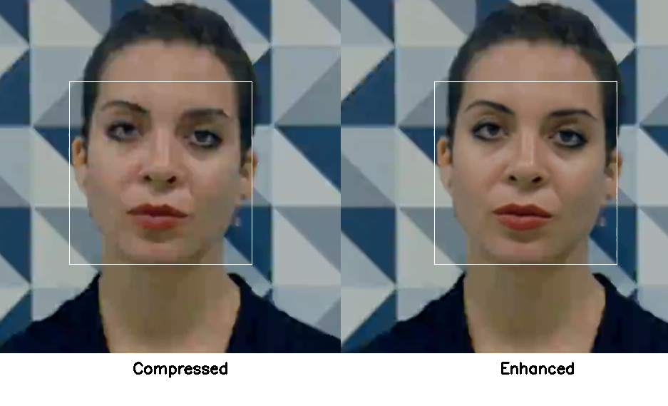
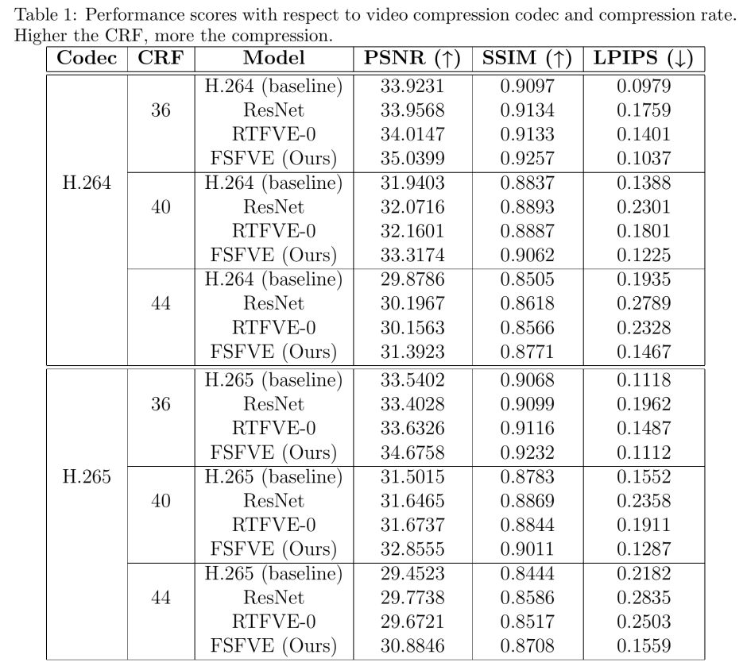
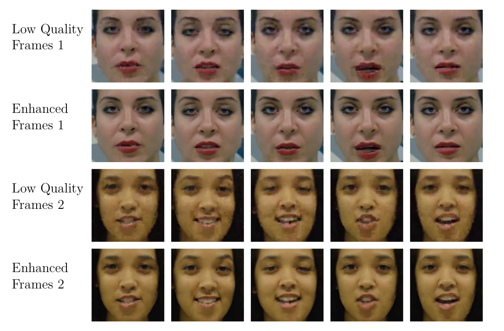

# FSFVE: Few-Shot Compressed Face Video Enhancement

**Real-time face video enhancement for low-bandwidth videocalls, trainable on as few as 10 frames in under 100 seconds on a CPU.**

[](assets/paper.pdf)
[](https://sigport.org/documents/fsfve)

---

## Demo

[](https://sigport.org/documents/fsfve)

*Click to watch the full demo video.*

---

## Overview

Millions of people around the world experience poor quality videocalls due to limited bandwidth, despite having adequate hardware. Existing enhancement models either require GPUs or are too slow to run in real time, making them impractical for this setting.

FSFVE addresses this by training a small, instance-specific model on just a few frames of the caller's face — either just before or at the start of a call — and using it to enhance the remaining frames in real time on a standard laptop CPU. The system can be deployed as a layer on top of any videoconferencing application (e.g. Zoom) by intercepting frames before they are displayed.

---

## Key Ideas

- **Few-shot, instance-specific training:** A model is trained per videocall instance using 10–30 frames selected via k-means clustering for diversity. Training completes in under 100 seconds on CPU.
- **Frequency-domain MLP:** Rather than using a CNN (too slow or too weak at this scale), the model operates on 8×8 DCT blocks of the face image using an MLP with sine activations. Inference is fast because the stride equals the block size, avoiding the spatial dimension reduction that slows CNNs.
- **Sine activations for fast convergence:** Sine activations produce well-behaved gradients that capture high-frequency detail, and together with the SIREN initialization scheme, yield fast and robust convergence — critical when training time is constrained.
- **Frequency-domain focal loss:** The L1 loss on DCT coefficients is weighted by the inverse of the JPEG luminance quantization matrix, emphasizing low-frequency components that matter most perceptually and accelerating convergence.
- **CPU real-time:** The model runs at over 30 FPS on a standard laptop CPU with under 1 million parameters.

---

## Results

FSFVE outperforms all CPU-compatible baselines across H.264 and H.265 codecs at multiple compression levels. Higher CRF = more compression.



BD-Rate: **-25.12%** | BD-PSNR: **+1.33 dB**

---

## Qualitative Results



*Low-quality compressed frames (rows 1 and 3) and FSFVE-enhanced output (rows 2 and 4). Compression artifacts around the eyes, mouth, and skin are significantly reduced.*

---

## Repository Structure

```
├── models/
│   ├── fsfve.py          # FSFVE model — MLP with sine activations in DCT domain
│   └── Loss.py           # Frequency-domain focal loss
├── data/
│   └── DFD.py            # Dataset class for paired LQ/HQ face crops
├── data_prep/
│   ├── crop.py           # Face detection, alignment, and crop extraction from video
│   └── cluster.py        # K-means frame selection for training data
├── train.py              # Training and evaluation script
├── video_face.py         # Real-time inference demo
└── config.yaml           # Example training configuration
```

---

## Citation

If you find this work useful, please cite:

```bibtex
@INPROCEEDINGS{11510464,
  author={Jois, Varun Ramesh and DiLillo, Antonella and Storer, James},
  booktitle={2026 Data Compression Conference (DCC)}, 
  title={FSFVE: Few Shot Compressed Face Video Enhancement}, 
  year={2026},
  pages={133-142},
  doi={10.1109/DCC66757.2026.00021}}

```
